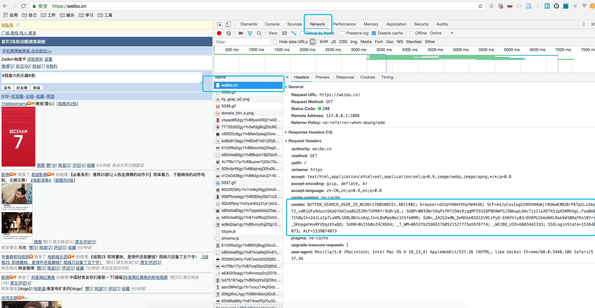

# WeiboSpider
This is a sina weibo spider built by scrapy

**这是一个持续维护的微博爬虫开源项目,有任何问题请开issue**

更多关于微博爬虫的介绍请移步:[微博爬虫总结：构建单机千万级别的微博爬虫系统](http://www.nghuyong.top/2018/09/12/spider/%E5%BE%AE%E5%8D%9A%E7%88%AC%E8%99%AB%E6%80%BB%E7%BB%93%EF%BC%9A%E6%9E%84%E5%BB%BA%E5%8D%95%E6%9C%BA%E5%8D%83%E4%B8%87%E7%BA%A7%E5%88%AB%E7%9A%84%E5%BE%AE%E5%8D%9A%E7%88%AC%E8%99%AB%E7%B3%BB%E7%BB%9F/)

## 项目说明
该项目分为3个分支，以满足不同的需要

|    分支   | 特点 | 单机每日抓取量 |
| :---: | :----: |:----: |
| [simple](https://github.com/nghuyong/WeiboSpider/tree/simple) | 单账号 | 十万级|
| [master](https://github.com/nghuyong/WeiboSpider/tree/master) | 账号池 | 百万级|
| [senior](https://github.com/nghuyong/WeiboSpider/tree/senior) | 账号池+分布式 | 千万级+ | 

该项目爬取的数据字段说明，请移步:[数据字段说明与示例](./data_stracture.md)

已经在senior分支的基础上新增了[search分支](https://github.com/nghuyong/WeiboSpider/tree/search)，用于微博关键词搜索


## update
- 2018/10/13 添加[微博搜索分支](https://github.com/nghuyong/WeiboSpider/tree/search)
- 2018/9/30 添加布隆过滤器

## 如何使用
下面是simple分支，也就是单账号爬取，每日十万级的抓取量

### 克隆本项目 && 安装依赖
本项目Python版本为Python3.6
```bash
git clone git@github.com:nghuyong/WeiboSpider.git
cd WeiboSpider
git checkout simple
pip install -r requirements.txt
```
除此之外，还需要安装mongodb，这个自行Google把

### 替换Cookie
访问https://weibo.cn/

并登陆，打开浏览器的开发者模式，再次刷新



复制weibo.cn这个数据包，network中的cookie值

将`sina/settings.py`中:
```python
DEFAULT_REQUEST_HEADERS = {
    'User-Agent': 'Mozilla/5.0 (Macintosh; Intel Mac OS X 10.13; rv:61.0) Gecko/20100101 Firefox/61.0',
    'Cookie':'OUTFOX_SEARCH_USER_ID_NCOO=1780588551.4011402; browser=d2VpYm9mYXhpYW4%3D; SCF=AsJyCasIxgS59OhHHUWjr9OAw83N3BrFKTpCLz2myUf2_vdK1UFy6Hucn5KaD7mXIoq8G25IMnTUPRRfr3U8ryQ.; SUBP=0033WrSXqPxfM725Ws9jqgMF55529P9D9WFGJINkqaLbAcTzz2isXDTA5JpX5KMhUgL.Foq0e0571hBp1hn2dJLoIp7LxKML1KBLBKnLxKqL1hnLBoMpe0ec1h5feKMR; SUB=_2A252a4N_DeRhGeBI61EV9CzPyD-IHXVVly03rDV6PUJbkdAKLRakkW1NRqYKs18Yrsf_SKnpgehmxRFUVgzXtwQO; SUHB=0U15b0sZ4CX6O4; _T_WM=0653fb2596917b052152f773a5976ff4; _WEIBO_UID=6603442333; SSOLoginState=1536482073; ALF=1539074073'
}
```
Cookie字段替换成你自己的Cookie

**如果爬虫运行出现403/302，说明账号被封/cookie失效，请重新替换cookie**

### 运行爬虫
```bash
scrapy crawl weibo_spider 
```
运行截图:


导入pycharm后，也可以直接执行`sina/spider/weibo_spider.py`

该爬虫是示例爬虫，将爬取 人民日报 和 新华视点 的 用户信息，全部微博，每条微博的评论，还有用户关系。

可以根据你的实际需求改写示例爬虫。

## 速度说明

一个页面可以抓取10则微博数据

下表是我的配置情况和速度测试结果

|    爬虫配置   | 配置值 |
| :---: | :----: |
| CONCURRENT_REQUESTS | 16 |
| DOWNLOAD_DELAY | 3s|
| 每分钟抓取网页量 | 15+ |
| 每分钟抓取数据量 | 150+ |
| 总体一天抓取数据量 | **20万+** |

实际速度和你自己电脑的网速/CPU/内存有很大关系。